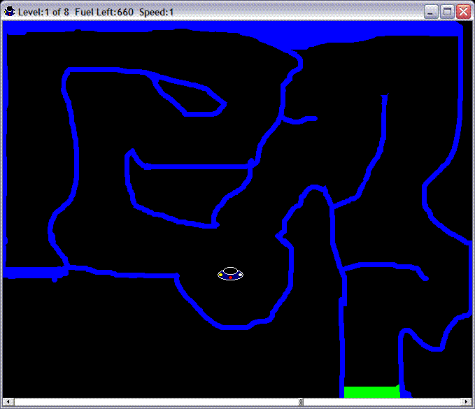



## A  \+\(Lunar Lander\)\+  A

### Description

A Very Fun Lunar Lander Game!!! In this game you have to delicately move your UFO through the maze of 8 different levels!!! Works great. Uses bitblt so no flickering. Level code is very simple and it is very easy and fun to make new levels. Doesn&#8217;t use Direct X in any way.
 
### More Info
 

             |
---                |---
**Submitted On**   |2005-10-04 00:56:22
**By**             |[RapidPix](https://github.com/Planet-Source-Code/PSCIndex/blob/master/ByAuthor/rapidpix.md)
**Level**          |Advanced
**User Rating**    |4.5 (18 globes from 4 users)
**Compatibility**  |VB 5\.0, VB 6\.0
**Category**       |[Games](https://github.com/Planet-Source-Code/PSCIndex/blob/master/ByCategory/games__1-38.md)
**World**          |[Visual Basic](https://github.com/Planet-Source-Code/PSCIndex/blob/master/ByWorld/visual-basic.md)
**Archive File**   |[A\_\_\+\(Lunar1937301042005\.zip](https://github.com/Planet-Source-Code/rapidpix-a-lunar-lander-a__1-62762/archive/master.zip)

